# BUKKi Database Schema Diagram

## Entity Relationship Diagram

```mermaid
erDiagram
    USERS {
        int id PK
        string email UK
        string password
        string firstName
        string lastName
        string phone
        enum role
        boolean isActive
        int trustScore
        string avatar
        string address
        string city
        string state
        string zipCode
        string country
        date dateOfBirth
        boolean emailVerified
        string emailVerificationToken
        string passwordResetToken
        date passwordResetExpires
        date createdAt
        date updatedAt
    }

    BUSINESSES {
        int id PK
        string name
        text description
        enum category
        string address
        string city
        string state
        string zipCode
        string country
        float latitude
        float longitude
        string phone
        string email
        string website
        string logo
        json images
        enum status
        json workingHours
        json customBookingFields
        string qrCode
        float rating
        int reviewCount
        boolean isActive
        boolean showRevenue
        int maxBookingsPerUserPerDay
        boolean onboardingCompleted
        string subscriptionPlan
        date subscriptionExpiresAt
        int ownerId FK
        date createdAt
        date updatedAt
    }

    SERVICES {
        int id PK
        string name
        text description
        decimal price
        int duration
        boolean isActive
        json images
        json customFields
        int maxBookingsPerSlot
        int advanceBookingDays
        int cancellationHours
        float rating
        int reviewCount
        int bookingCount
        int businessId FK
        date createdAt
        date updatedAt
    }

    BOOKINGS {
        int id PK
        timestamp appointmentDate
        timestamp appointmentEndDate
        enum status
        enum paymentStatus
        decimal totalAmount
        json customFieldValues
        string notes
        string qrCode
        timestamp checkedInAt
        boolean checkedIn
        timestamp cancelledAt
        string cancellationReason
        timestamp reminderSentAt
        json paymentDetails
        int customerId FK
        int businessId FK
        int serviceId FK
        date createdAt
        date updatedAt
    }

    REVIEWS {
        int id PK
        int businessId FK
        int userId FK
        int bookingId FK
        int rating
        text comment
        boolean isActive
        timestamp createdAt
        timestamp updatedAt
    }

    %% Relationships
    USERS ||--o| BUSINESSES : "owns"
    USERS ||--o{ BOOKINGS : "makes"
    USERS ||--o{ REVIEWS : "writes"
    BUSINESSES ||--o{ SERVICES : "offers"
    BUSINESSES ||--o{ BOOKINGS : "receives"
    BUSINESSES ||--o{ REVIEWS : "receives"
    SERVICES ||--o{ BOOKINGS : "booked_for"
    BOOKINGS ||--o{ REVIEWS : "reviewed_in"
```

## Database Tables Summary

### Core Tables

| Table | Purpose | Key Features |
|-------|---------|--------------|
| **users** | User accounts and profiles | Trust score, email verification, role-based access |
| **businesses** | Business information and settings | Geolocation, working hours, booking limits |
| **services** | Business services offered | Custom fields, pricing, duration, availability |
| **bookings** | Appointment bookings | QR codes, status tracking, payment integration |
| **reviews** | Customer reviews and ratings | 5-star system, comments, trust score impact |

### Key Relationships

1. **User → Business** (1:1) - Business owners
2. **User → Bookings** (1:N) - Customer bookings
3. **User → Reviews** (1:N) - User reviews
4. **Business → Services** (1:N) - Business services
5. **Business → Bookings** (1:N) - Business bookings
6. **Business → Reviews** (1:N) - Business reviews
7. **Service → Bookings** (1:N) - Service bookings
8. **Booking → Reviews** (1:N) - Booking reviews

### Indexes and Constraints

#### Primary Keys
- All tables have auto-incrementing integer primary keys
- Users table has unique email constraint

#### Foreign Keys
- `businesses.ownerId` → `users.id`
- `services.businessId` → `businesses.id`
- `bookings.customerId` → `users.id`
- `bookings.businessId` → `businesses.id`
- `bookings.serviceId` → `services.id`
- `reviews.businessId` → `businesses.id`
- `reviews.userId` → `users.id`
- `reviews.bookingId` → `bookings.id`

#### Check Constraints
- `users.trustScore` (0-100)
- `businesses.maxBookingsPerUserPerDay` (≥1)
- `reviews.rating` (1-5)

#### Indexes
- Email indexes for fast lookups
- Geospatial indexes for location queries
- Status indexes for filtering
- Date indexes for time-based queries

## Data Flow

### User Registration Flow
1. User registers → `users` table
2. Email verification sent
3. Account activated

### Business Onboarding Flow
1. Business owner creates business → `businesses` table
2. Admin approval process
3. Services added → `services` table
4. Business goes live

### Booking Flow
1. Customer books service → `bookings` table
2. QR code generated
3. Business confirms booking
4. Customer checks in (QR scan)
5. Booking completed
6. Review prompt triggered

### Review Flow
1. Customer submits review → `reviews` table
2. Business rating updated
3. Trust score calculated
4. Review displayed on business page

## Performance Considerations

### Query Optimization
- **Geospatial queries** for nearby businesses
- **Time-based queries** for availability
- **Status-based filtering** for bookings
- **Rating calculations** for reviews

### Scalability Features
- **JSON fields** for flexible data storage
- **Enum types** for consistent data
- **Proper indexing** for fast queries
- **Relationship optimization** for joins

### Data Integrity
- **Foreign key constraints** for referential integrity
- **Check constraints** for data validation
- **Unique constraints** for data uniqueness
- **Cascade rules** for data consistency
